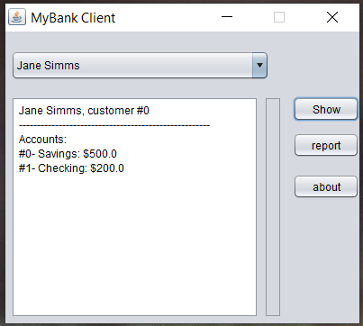
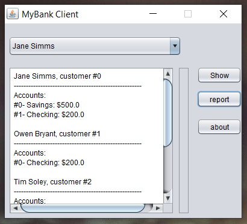
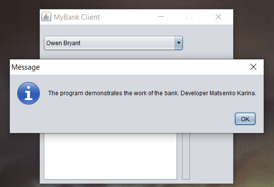

# Результат 

## На "п'ять"
1.Кнопка Report має виводити у нижній частині вікна звіт за клієнтами такого ж виду, як у роботі номер 8 (див. CustomerReport).

2.Запустіть проект, впевніться, що все працює як очікувалось. Продемонстрируйте результат викладачеві.
